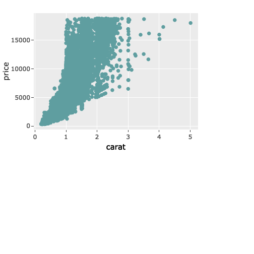
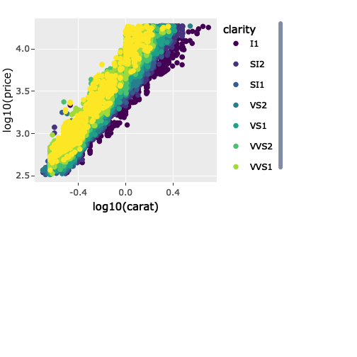

## The Product
---
The diamond price predictor is a data product that is super helpful in finding a fair price for the diamond of your choice base on 2 predictor variables:

1. Diamond Carat Size
2. Diamond Clarity

The application takes a saample of 2000 observations from the diamonds dataset which is included in ggplot package.

You can find the deployed application on shinyapps.io here:

https://dmac088.shinyapps.io/ddp_project/


--- &twocol

## Exploratory Data Analysis

*** =left
The raw data

```r
ggplotly(ggplot(diamonds,
  aes(carat, price))+
  geom_point(color="cadetblue"), 
  height=300, width=400) 
```



*** =right
Log transformed data with clarity

```r
ggplotly(ggplot(diamonds,
aes(log10(carat), log10(price), 
    color=clarity)) + geom_point(), 
height=300, width=400) 
```



*** =fullwidth

---

## Exploratory Data Analysis Cont'd

From the 1st chart (raw data) we can see that there is a strong positive correlation between carat size and price, although with some heteroscedasticity, therefore it makes sense to log transform the data.

From the 2nd chart we see the result of the log transformation on price and carat, and additionally overlay the clarity (categorical) dimension with color.

It seems that there's definitely a relationship between clarity and price since we see very clear color clusters across the axes. Both carat and clarity look like good candidate predictors for our model, so lets proceed to fit a linear model and compute the goodness of fit (Rsq):


```r
 model1 <- lm(log10(price) ~ log10(carat) + as.factor(clarity), data = diamonds)
 summary(model1)$r.squared
```

```
## [1] 0.9653684
```
We see that the resulting Rsq is quite good at 0.96, this model will make a nice data product for predicting diamond price.

---

## Summary

Thank you for taking the time to read this assigment for grading.

